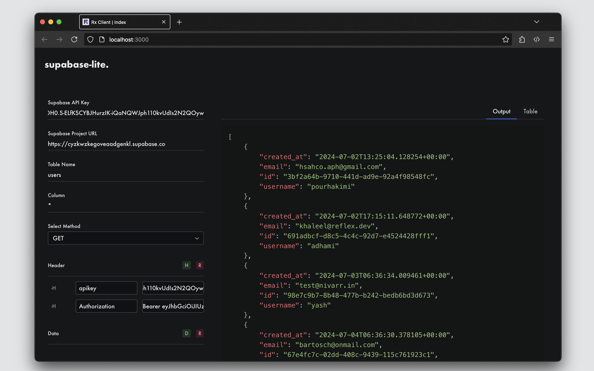
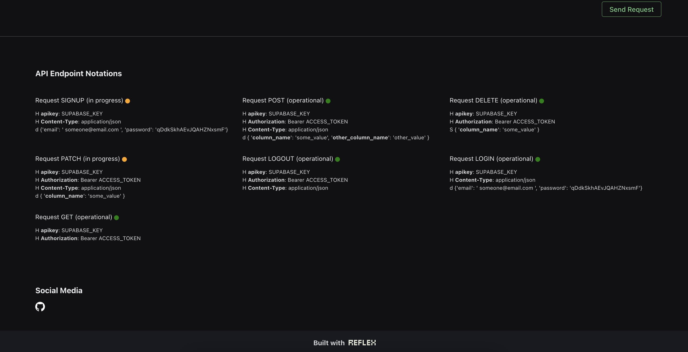

# Introduction

This lightweight web application is designed for testing `Supabase API` endpoints. The tool itself simplifies the process of interacting with Supabase API's, making endpoint testing user-friendly. The entire application is built using `Reflex`.





## What you need to get started

To use this API client you'll need to have several things:
1. A `Supabase` account and a database already setup.
2. Latest version of `Reflex` installed. 

```bash
pip install reflex --upgrade
```

## API Methods Included

The following is a list of supported request methods:

`GET`: Operational 
<br>
`POST`: Operational
<br>
`DELETE`: Operational
<br>
`PATCH`: In progress
<br>
`LOGIN`: Operational
<br>
`LOGOUT`: In progress
<br>
`SIGNUP`: In progress

## License

This project is open-source and licensed under the [MIT License](LICENSE).